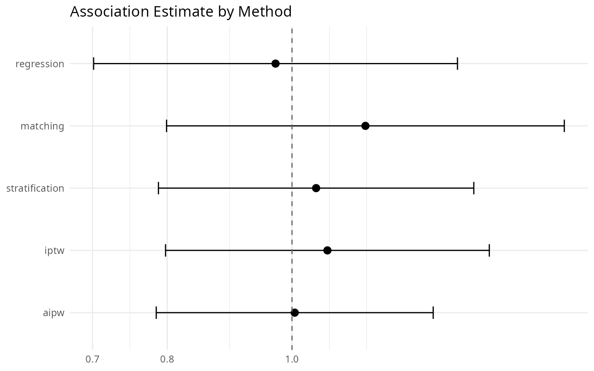
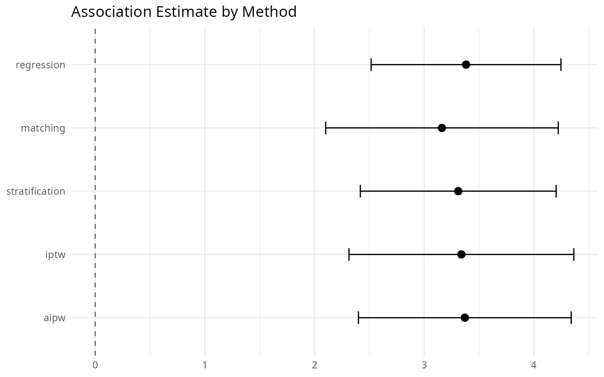
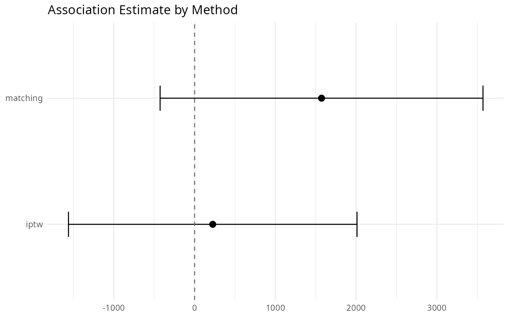

# Does It Get the Right Answer? Validating IndepAssoc Against Known Results

## Introduction

The simulated examples in the quick-start vignette prove the pipeline
runs; this one checks whether it gets the *right* answer. The logic is
that of an answer key: use datasets whose correct result is already
known, run the package’s methods on them, and compare what comes out
with what should be true.

The first dataset is NHEFS (NHANES Epidemiologic Follow-up Study), from
the `causaldata` package — the canonical textbook example for
regression, matching, stratification, IPTW, and AIPW (Hernán & Robins,
*Causal Inference: What If*). Its findings are well established, so
agreement between the package’s results and the textbook answers is
meaningful: the scientific question is whether quitting smoking is
independently associated with an outcome after adjusting for measured
confounders.

The second is the NSW demonstration, a randomized job-training program
whose effect on 1978 earnings was measured directly in the experiment —
the Dehejia & Wahba (1999) benchmark estimate of **\$1,794**.
[`MatchIt::lalonde`](https://kosukeimai.github.io/MatchIt/reference/lalonde.html)
combines the program’s treated units with a nonexperimental comparison
group, so we can run the package’s observational methods on that
combined data and check whether they recover the answer the experiment
already gave us.

## The five methods on NHEFS

``` r

nhefs_ok <- requireNamespace("causaldata", quietly = TRUE)
if (nhefs_ok) {
  nhefs <- causaldata::nhefs
  covs <- c("sex", "age", "race", "education", "smokeintensity",
            "smokeyrs", "exercise", "active", "wt71")
  nhefs_cc <- nhefs[!is.na(nhefs$wt82_71), ]
}
if (!nhefs_ok) {
  message("The `causaldata` package is not installed; ",
          "the analysis chunks below are skipped.")
}
```

The binary exposure is `qsmk` (quit smoking, 1 = yes) and the covariates
are the standard set used in the textbook worked example: age, sex,
race, education, smoking intensity, smoking years, exercise, activity,
and baseline weight.

### Binary outcome: death

``` r

library(IndepAssoc)

# We set a fixed random seed (1) before running the pipeline so the matching
# step is reproducible; see `?run_pipeline`.
set.seed(1)
result_death <- run_pipeline(
  data = nhefs,
  exposure = "qsmk",
  covariates = covs,
  outcome = "death",
  type = "binary",
  methods = c("regression", "matching", "stratification", "iptw", "aipw")
)
format_comparison(result_death$comparison)
#>           Method   OR    95% CI p-value    n
#> 1     Regression 0.97 0.70–1.34   0.859 1629
#> 2       Matching 1.14 0.80–1.63   0.469  834
#> 3 Stratification 1.04 0.79–1.38   0.819 1629
#> 4           IPTW 1.07 0.80–1.42   0.668 1629
#> 5           AIPW 1.00 0.78–1.29   0.969 1629
```

All five methods — outcome regression, matching, stratification, IPTW,
and AIPW — return odds ratios close to 1 (the value that means no
association), with confidence intervals that straddle 1 (they include
that no-effect value) and p-values well above 0.05. The agreement across
five functionally different adjustment strategies (those that model the
outcome directly and those that model treatment assignment) is
reassuring: the null finding is not an artifact of any single estimator.
Had the estimates diverged sharply — say, matching far from regression —
that would flag outcome-model misspecification or poor propensity-score
overlap and warrant closer inspection of the propensity-score
distribution.

``` r

plot_comparison(result_death$comparison, log_scale = TRUE)
```



This is a confounder-adjusted association under the standard
no-unmeasured-confounding assumption, not a proven causal effect.

### Continuous outcome: weight change (wt82_71)

Here `nhefs_cc` contains only the 1566 complete cases (the 63 rows with
missing `wt82_71` are excluded; the restriction is stated here for
transparency).

``` r

# We set a fixed random seed (1) before running the pipeline so the matching
# step is reproducible; see `?run_pipeline`.
set.seed(1)
result_wt <- run_pipeline(
  data = nhefs_cc,
  exposure = "qsmk",
  covariates = covs,
  outcome = "wt82_71",
  type = "continuous",
  methods = c("regression", "matching", "stratification", "iptw", "aipw")
)
format_comparison(result_wt$comparison)
#>           Method Mean Diff    95% CI p-value    n
#> 1     Regression      3.38 2.52–4.25  <0.001 1566
#> 2       Matching      3.16 2.10–4.22  <0.001  780
#> 3 Stratification      3.31 2.42–4.20  <0.001 1566
#> 4           IPTW      3.34 2.31–4.36  <0.001 1566
#> 5           AIPW      3.37 2.40–4.34  <0.001 1566
```

Here `estimate` is the adjusted mean weight change in kilograms
associated with quitting smoking. All five methods agree on a gain of
roughly 3 to 3.5 kg, with narrow confidence intervals that exclude 0 (so
the gain is not plausibly zero). The convergence across methods is
consistent with the well-documented finding from this dataset that
quitting smoking is associated with weight gain.

``` r

plot_comparison(result_wt$comparison, log_scale = FALSE)
```



This is a confounder-adjusted association under the standard
no-unmeasured-confounding assumption, not a proven causal effect.

## The matching and weighting estimates against an experimental benchmark

``` r

lalonde_ok <- requireNamespace("MatchIt", quietly = TRUE)
if (lalonde_ok) {
  lalonde <- MatchIt::lalonde
}
if (!lalonde_ok) {
  message("The `MatchIt` package is not installed; ",
          "the analysis chunks below are skipped.")
}
```

Observational studies cannot be validated against an experimental
benchmark the way randomized trials can — but a few classic datasets let
us do exactly that.
[`MatchIt::lalonde`](https://kosukeimai.github.io/MatchIt/reference/lalonde.html)
combines the 185 experimental treated units with a nonexperimental
comparison group (the Dehejia–Wahba sample). Applying observational
methods to this hybrid dataset and comparing their estimates to the
known \$1,794 benchmark is a standard sanity check: methods that land
near the benchmark are doing the adjustment job well on real, messy
data. Here we apply the two propensity-score methods the benchmark is
designed to validate — `matching` (1:1 nearest-neighbor PSM with a 0.2
caliper and within-pair estimation) and `iptw` (stabilized
inverse-probability weights) — to `re78` (earnings in 1978, continuous
outcome), with the standard covariate set.

``` r

# We set a fixed random seed (1) before running the pipeline so the matching
# step is reproducible; see `?run_pipeline`.
set.seed(1)
result <- run_pipeline(
  data = lalonde,
  exposure = "treat",
  covariates = c("age", "educ", "race", "married", "nodegree", "re74", "re75"),
  outcome = "re78",
  type = "continuous",
  methods = c("matching", "iptw")
)
format_comparison(result$comparison)
#>     Method Mean Diff           95% CI p-value   n
#> 1 Matching   1571.74  -426.86–3570.35   0.122 226
#> 2     IPTW    224.68 -1561.40–2010.75   0.805 614
```

Both estimates are the adjusted mean difference in 1978 earnings
(dollars) associated with the NSW program. The experimental benchmark is
\$1,794.

``` r

plot_comparison(result$comparison, log_scale = FALSE)
```



The propensity-score matching estimate lands close to the experimental
benchmark of \$1,794, while the IPTW estimate deviates further — a
pattern that mirrors the original Dehejia & Wahba finding that PSM
recovers the experimental ATT (the average treatment effect among the
treated — the program’s effect on the people who actually took part)
much better than naive or heavily weighted estimators on this dataset.
Divergence from the benchmark is itself informative, signaling
sensitivity to the weighting specification or limited covariate overlap.

This is a confounder-adjusted association under the standard
no-unmeasured-confounding assumption, not a proven causal effect.

## References

- Hernán, M.A. and Robins, J.M. (2020). *Causal Inference: What If*.
  Chapman & Hall/CRC.
- Dehejia, R.H. and Wahba, S. (1999). Causal Effects in Nonexperimental
  Studies: Reevaluating the Evaluation of Training Programs. *Journal of
  the American Statistical Association*, 94(448), pp.1053-1062.
- Lalonde, R. (1986). Evaluating the Econometric Evaluations of Training
  Programs with Experimental Data. *American Economic Review*, 76(4),
  pp.604-620.
- The NHEFS data are distributed with the `causaldata` package (Nick
  Huntington-Klein and Malcolm Barrett); see `citation("causaldata")`.
- The `lalonde` data are distributed with the `MatchIt` package (Ho,
  Imai, King and Stuart); see `citation("MatchIt")`.
