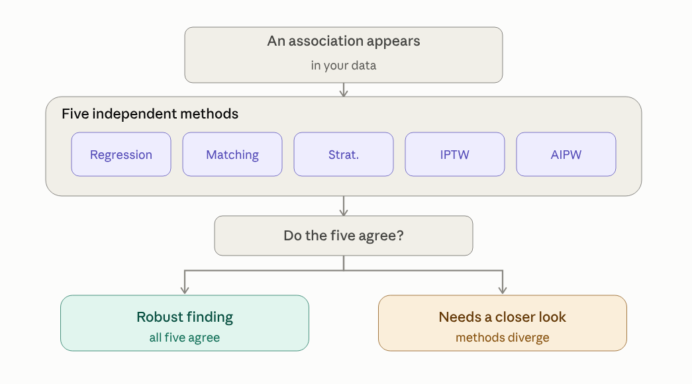

# IndepAssoc

> **One function call. Five independent methods. Publication-ready confounder-adjusted associations.**

[](https://github.com/mostafa-abbas/IndepAssoc/actions/workflows/R-CMD-check.yaml)
[](https://opensource.org/licenses/MIT)

**Does an exposure–outcome association survive being tested through five distinct methods?**

IndepAssoc answers one question: is a risk factor (an exposure) genuinely
associated with an outcome after other relevant factors are accounted for — or
is the apparent link a statistical artifact? Instead of trusting a single
statistical method, the package tests the same association through five
methods that each rely on different modeling assumptions, and shows whether
they agree. When they agree, the finding is robust; when they do not, the
signal needs a closer look.



## In one picture

Running `run_pipeline()` on the SUPPORT RHC cohort (n = 5,735, 50 confounders) —
all five methods agree that RHC is associated with increased 30-day mortality:


## New to these methods?

If you are not a statistician, here is what each method does in one sentence:

- **Regression** — builds a model of the outcome that includes the exposure
  and the other factors at once, then reports the exposure's association with
  the outcome after holding the other factors fixed.
- **Matching** — pairs each exposed person with an otherwise similar
  unexposed person and compares outcomes within the pairs.
- **Stratification** — groups people with similar backgrounds, compares
  exposed and unexposed within each group, then pools the comparisons.
- **IPTW (inverse probability of treatment weighting)** — gives each person a
  weight so the exposed and unexposed groups look alike on the other factors,
  then compares the weighted groups.
- **AIPW (augmented IPTW)** — combines the IPTW reweighting with an outcome
  regression; it is doubly robust, so the estimate stays reliable if either
  the propensity model or the outcome model is correctly specified, not
  necessarily both.

## What it is — and what it is not

**What it is:** a pipeline that tests whether an exposure is independently
associated with an outcome — adjusting for confounding factors via five
distinct methods — regression, matching, stratification, and two
propensity-score weighting approaches — and produces publication-ready tables
and effect estimates with minimal code.

**What it is not:** proof of causation. The package reports confounder-adjusted
associations under the standard no-unmeasured-confounding assumption; it does
not establish causal effects. An association — however robust — is not a causal
effect.

## How it works

```r
library(IndepAssoc)
data(example_cohort)

set.seed(1)
res <- run_pipeline(
  data = example_cohort,
  exposure = "exposure",
  covariates = c("age", "diabetes", "hypertension", "bmi"),
  outcome = "outcome_continuous",
  type = "continuous",
  methods = c("regression", "matching", "stratification", "iptw", "aipw")
)
format_comparison(res$comparison)
```

`format_comparison()` rounds the raw `$comparison` data frame into the
publication-ready table below. Here `matching` is propensity-score matching
with conditional-logit/paired estimation (conditional logistic regression
stratified by matched pair for binary outcomes, a within-pair fixed-effects
linear model for continuous outcomes).

```
          Method Mean Diff     95% CI p-value   n
1     Regression      1.54  0.59–2.48   0.001 500
2       Matching      2.15  0.95–3.34  <0.001 324
3 Stratification      1.58  0.45–2.71   0.006 500
4           IPTW      1.38 -0.05–2.81   0.059 500
5           AIPW      1.48  0.51–2.46   0.003 500
```

The five methods do not all target the same estimand: `matching` targets the
average treatment effect on the treated (ATT) by construction, `iptw` and
`aipw` target the marginal ATE over the full analytic sample, `stratification`
pools stratum-specific effects across the full sample, and `regression`
reports a conditional (covariate-adjusted) effect — the binary-outcome odds
ratio is non-collapsible, so it is not numerically equal to a marginal ATE.
Agreement across the five is still meaningful robustness evidence, but they are
related quantities, not five copies of one number.

## A real-world validation

The same pipeline holds up on a real clinical question. The bundled `rhc_sample`
cohort — 5,735 intensive-care patients from the SUPPORT study — was analyzed
for the association between right heart catheterization (RHC) and 30-day
mortality, adjusting for 50 confounders with all five methods. Each method
independently found that RHC was associated with increased 30-day mortality,
with odds ratios in the 1.3–1.5 range and confidence intervals excluding no
effect:


That all five methods point the same way on a confounder-adjusted benchmark
shows the pipeline works on real data, not only on simulated cohorts. The full
analysis — balance checks, matching diagnostics, and sensitivity checks — is in
the [rhc-validation vignette](https://mostafa-abbas.github.io/IndepAssoc/articles/rhc-validation.html).

## Background

IndepAssoc is the packaged form of the analysis pipeline used in two published
retrospective cohort studies from the same author group: *[Female sex is
associated with short-term mortality in coronary artery bypass grafting
patients: A propensity-matched analysis](https://doi.org/10.1016/j.heliyon.2025.e41723)*
(Heliyon, 2025) and *[Atrial appendage closure is associated with increased risk
for postoperative atrial fibrillation](https://doi.org/10.1186/s13019-024-03119-6)*
(Journal of Cardiothoracic Surgery, 2024). Both studies used the same
propensity-score workflow — a logistic propensity-score model, 1:1
nearest-neighbor matching, ASMD balance checks, paired descriptive tests, and
conditional outcome models — which this package generalizes into a reusable
interface with five confounding-adjustment methods.

## Datasets

Two datasets ship with the package:

- `example_cohort` — a simulated 500-row cohort with a known treatment effect,
  for quick runs of the full pipeline.
- `rhc_sample` — the cleaned Right Heart Catheterization (RHC) cohort from the
  SUPPORT study (5735 rows, 50 confounders), the basis of the `rhc-validation`
  vignette. It is a confounder-adjusted association benchmark, not a proof of
  causality (see `?rhc_sample`).

Both are lazy-loaded via `data()`; the raw-generation scripts live in
`data-raw/` (`simulate_example_cohort.R`, `prepare_rhc.R`) and are excluded
from the installed package.

## Installation

```r
# install.packages("remotes")
remotes::install_github("mostafa-abbas/IndepAssoc")
```

Alternatively, install from source with the package source checked out:

```r
install.packages("devtools")
devtools::install()
```

`causaldata` and `MatchIt` are needed for the vignettes.

## Validation

The package has 631 passing unit tests and passes `R CMD check` cleanly
(0 errors, 0 notes; one environmental warning — `qpdf` not installed on the
test machine — unrelated to package code). The methods are validated against the bundled `example_cohort`
(a simulated cohort with a known treatment effect) and `rhc_sample`, the real
Right Heart Catheterization cohort from the SUPPORT study (5,735 patients,
50 confounders) used in the `rhc-validation` vignette.

## Reproducibility

Matching-based results draw on the random number generator, so a fixed seed is
required to reproduce them. Set it explicitly — `run_pipeline(..., seed = N)`
or, for direct matching, `match_cohort(..., seed = N)` — and reuse the same
seed value to obtain identical results.

## Getting Help

* **Bug reports & feature requests:** [Open an issue](https://github.com/mostafa-abbas/IndepAssoc/issues)
* **Usage questions:** see the [clinician walkthrough](https://mostafa-abbas.github.io/IndepAssoc/articles/clinician-walkthrough.html) or [quick-start guide](https://mostafa-abbas.github.io/IndepAssoc/articles/indepassoc-quickstart.html)
* **Citing this package:** see `CITATION.cff`, or run `citation("IndepAssoc")` in R
