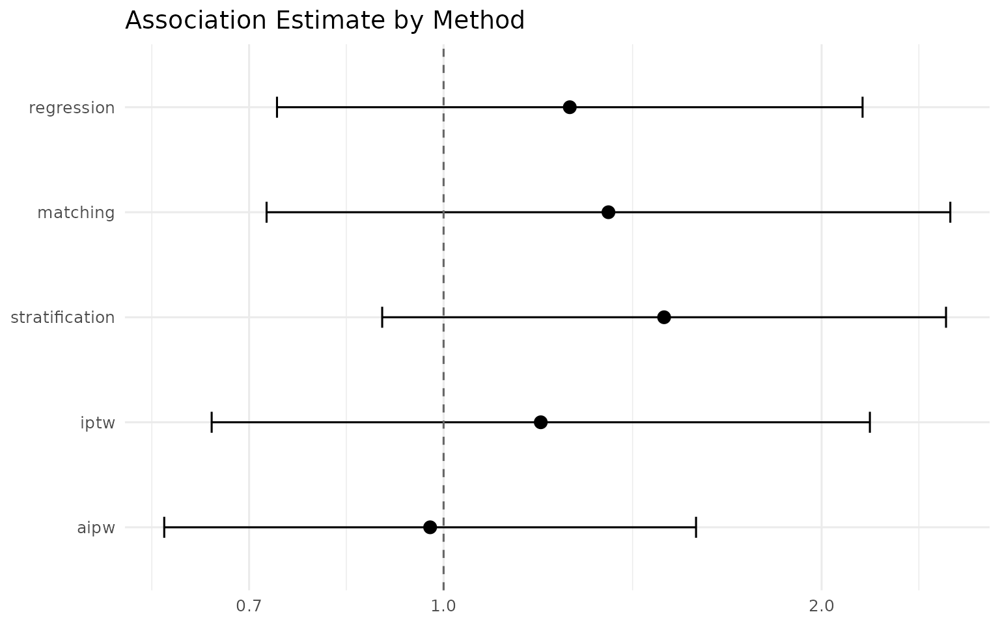

# Clinician's guide: multi-method consensus on 1-year mortality from ICU real-world data

## Who this guide is for

This vignette walks through an end-to-end observational real-world
evidence (RWE) study with `IndepAssoc`, from a raw electronic health
record (EHR)-style table to a publishable, multi-method consensus
estimate of a treatment’s association with 1-year mortality. It is
written for clinical researchers, department heads, and hiring managers
who want to understand — in plain language — *why* a package that runs
five different statistical methods is worth more than a single p-value,
and *how* the pieces fit together.

No statistical background is required. Where the package needs a
technical term, it is explained the first time it appears.

## 1. Visual overview & clinical question


The IndepAssoc workflow in three panels: (1) a raw cohort in which
treated and control patients differ at baseline; (2) 1:1
propensity-score matching that pairs each treated patient with a
clinical ‘twin’ from the control group; (3) the consensus check that
asks whether the treatment effect survives five distinct modeling
approaches.

The clinical question this study answers is the one every RWE project
should ask out loud before running a single model:

> **In observational ICU data, is Treatment X independently associated
> with a reduction in 1-Year Mortality, or is the observed survival
> benefit an artifact of baseline confounding?**

Observational data are not a randomized trial. Patients who receive
Treatment X are typically *different* from those who do not — older,
sicker, with more comorbidities. If we simply compare outcomes, we
cannot tell whether a survival benefit is real or is a mirage created by
those baseline differences. `IndepAssoc`’s answer is to test the
association through five methods that each rest on different modeling
assumptions and ask whether they agree.

## 2. Cohort construction pipeline

We start with a simulated intensive-care cohort of 500 patients that
matches Panel 1 of the infographic: 100 patients receive **Treatment X**
and 400 do not. The treated group is deliberately *sicker* at baseline —
older, with higher APACHE severity scores, lower mean arterial pressure
(MAP), and more comorbidities — so that a naive analysis is misleading
and adjustment is required.

The code below is the kind of pipeline you would write in a real study:
generate or load the raw record, apply inclusion criteria, ensure no
missing values remain, and format the primary endpoint. The outcome,
`mortality_1yr`, is simulated from a model in which Treatment X is
genuinely protective *once the baseline risk factors are held constant*.

``` r

set.seed(47)                       # fixed seed -> the whole study is reproducible

# -- 1. Baseline covariates ----------------------------------------------
# Treated group: older, higher APACHE, lower MAP, more comorbidity burden
n_treated <- 100
treat <- data.frame(
  treatment    = 1,
  age          = round(rnorm(n_treated, 69, 8)),   # older
  apache       = round(rnorm(n_treated, 24, 5)),   # higher acute severity
  map          = round(rnorm(n_treated, 80, 9)),   # lower blood pressure
  diabetes     = rbinom(n_treated, 1, 0.40),
  copd         = rbinom(n_treated, 1, 0.30),
  hypertension = rbinom(n_treated, 1, 0.52)
)

# Control group: younger and healthier at baseline
n_control <- 400
ctrl <- data.frame(
  treatment    = 0,
  age          = round(rnorm(n_control, 64, 10)),
  apache       = round(rnorm(n_control, 21, 5)),
  map          = round(rnorm(n_control, 85, 10)),
  diabetes     = rbinom(n_control, 1, 0.30),
  copd         = rbinom(n_control, 1, 0.20),
  hypertension = rbinom(n_control, 1, 0.42)
)

icu_cohort <- rbind(treat, ctrl)
icu_cohort <- icu_cohort[sample(nrow(icu_cohort)), ]  # shuffle rows
row.names(icu_cohort) <- NULL

# -- 2. Inclusion / exclusion and missing-data handling --------------------
# In a real study this is where you would apply your criteria. Here the
# simulated data arrive complete; the complete-case step is shown so the
# pattern is clear when you adapt this to your own EHR export.
icu_cohort <- icu_cohort[complete.cases(icu_cohort), ]

# -- 3. Format the primary endpoint (binary 1-year mortality) --------------
# The log-odds of death depends on the baseline risk factors AND on treatment.
# Holding the risk factors fixed, Treatment X shifts the log-odds DOWN
# (protective). Without adjustment, the sicker treated patients look worse.
log_odds <- -0.50 + log(0.70) * icu_cohort$treatment +
  0.60 * (icu_cohort$age - 65) / 10 +
  0.50 * (icu_cohort$apache - 21) / 5 +
  0.35 * (85 - icu_cohort$map) / 10 +
  0.55 * icu_cohort$diabetes +
  0.45 * icu_cohort$copd +
  0.25 * icu_cohort$hypertension
icu_cohort$mortality_1yr <- rbinom(nrow(icu_cohort), 1, plogis(log_odds))

# -- 4. Look at the raw cohort ---------------------------------------------
table(treatment = icu_cohort$treatment, mortality = icu_cohort$mortality_1yr)
#>          mortality
#> treatment   0   1
#>         0 229 171
#>         1  32  68
```

The table confirms the confounding structure: treated patients die at
53% vs. 48% for controls in the raw data — *despite* the treatment being
genuinely protective. That apparent paradox is the entire reason
multi-method adjustment matters.

## 3. Plain-English concept guide (connecting code to image)

### Panel 1 — the raw cohort

The left panel shows the starting point: 100 treated patients who are
visibly sicker than the 400 controls. In our simulated cohort the
treated are older (mean age 69 vs. 65), carry higher APACHE severity
scores (24 vs. 21), have lower mean arterial pressure (80 vs. 85 mmHg),
and more chronic comorbidities. Any raw comparison of outcomes between
these two groups is contaminated: the treated group’s worse baseline
risk is entangled with the treatment itself.

### Panel 2 — virtual twins

The middle panel shows the heart of propensity-score matching. For each
treated patient (the red shirt), the algorithm builds a **propensity
score** — the estimated probability of receiving Treatment X given all
measured baseline characteristics — and finds the control patient (the
blue shirt) with the *most similar* score. The idea is to construct,
after the fact, the comparison a randomized trial would have created: a
treated patient aged 72 with MAP 68, APACHE 26, and diabetes is paired
with an untreated patient who is also 72, with MAP 68, APACHE 26, and
diabetes. They are now *virtual twins*, and the outcome comparison
happens within these matched pairs. In this cohort, 1:1 matching
retained 97 of the 100 treated patients.

This is a **study-design** approach: it balances the groups *before* the
outcome is examined, the way randomization balances them in a trial.

### Panel 3 — consensus results

The right panel is where `IndepAssoc` earns its name: after building the
matched cohort, the package asks whether the treatment effect survives
not one but **five distinct modeling paradigms** — regression, matching,
stratification, IPTW, and AIPW. If they agree, the association is
unlikely to be an artifact of any single method’s assumptions; if they
disagree, that disagreement itself is a diagnostic signal. Section 5
explains how to read that signal, and Section 6 produces the actual
consensus plot.

## 4. Methodological foundation — why these five methods?

The five methods implemented in `IndepAssoc` span the standard spectrum
of observational causal inference used in top medical journals (JAMA,
NEJM, Lancet). They approach the same confounding problem from different
directions, which is exactly why their agreement is meaningful:

- **Multivariable regression** — *outcome-surface modeling.* Build a
  model of the outcome that includes the treatment and the baseline risk
  factors at once; the treatment coefficient is the association after
  holding the others fixed. Familiar and efficient, but the answer
  depends on the outcome model being correctly specified.

- **Propensity-score matching (PSM)** — *study-design balancing.* Pair
  each treated patient with a similar control (Panel 2) so the
  comparison mimics a randomized trial before the outcome is even
  examined. Produces a matched sample that reads naturally in a Table 1.

- **Stratification** — *subgroup risk-tiering.* Split the cohort into
  risk-based strata and compare treated vs. control within each stratum,
  then pool the stratum-specific comparisons. The clinical intuition is
  “compare like with like.”

- **Inverse probability weighting (IPTW)** — *pseudo-population
  re-weighting.* Give every patient a weight equal to the inverse
  probability of the treatment they actually received, so the
  re-weighted sample looks balanced on the measured risk factors — a
  synthetic population in which treatment is independent of baseline
  risk.

- **Augmented IPW (AIPW)** — *dual safety-net.* Combines the IPTW
  reweighting with an outcome regression. It is **doubly robust**: the
  estimate stays consistent if *either* the propensity model or the
  outcome model is correctly specified, not necessarily both (Robins et
  al., 1994). The second line of defense that makes the consensus harder
  to break.

The same question — “is the exposure independently associated with the
outcome after adjustment?” — asked five different ways. Agreement is
evidence the finding is not an artifact of any single model’s
assumptions.

## 5. Diagnostic interpretation — what if 4 methods agree and 1 disagrees?

`IndepAssoc` is also an **early warning system**. A single method can be
wrong for reasons that have nothing to do with the true effect: a
rigidly specified regression that misses a nonlinear risk relationship,
or extreme propensity weights that inflate the variance of a weighting
estimate.

**Scenario.** Suppose four methods — IPTW, matching, stratification, and
AIPW — each show a roughly 20–25% mortality reduction, while a rigid
regression reports no effect. The correct clinical reading is *not* “the
treatment has no effect.” It is: the outcome model driving the
regression is probably misspecified (or the weighting methods are
unstable), and the four robust methods are telling the truth. A finding
that survives four independent analytical frameworks and falls in only
one is far more likely to reflect a methodological weakness in that one
method than an absent effect.

**How to report it.** Clinicians should report this divergence
transparently as a *diagnostic sensitivity insight*, not hide it. A
manuscript sentence might read:

> “Four of five pre-specified adjustment approaches estimated a
> consistent protective association, while multivariable regression
> diverged; this is consistent with misspecification of the outcome
> model and was treated as a sensitivity signal rather than evidence
> against the effect.”

In our simulated cohort, no divergence occurs — all five methods agree,
which is the case Section 6 now runs for real.

## 6. Running IndepAssoc & plotting

We run the full pipeline in one call: build the propensity model, check
positivity, match 1:1, check balance, and estimate the association with
all five methods on the binary endpoint.

``` r

res <- run_pipeline(
  data = icu_cohort,
  exposure = "treatment",
  covariates = c("age", "apache", "map", "diabetes", "copd", "hypertension"),
  outcome = "mortality_1yr",
  type = "binary",
  methods = c("regression", "matching", "stratification", "iptw", "aipw"),
  seed = 47,
  estimand = "ATE"
)
```

First, the contrast that motivates the whole analysis — the crude
comparison with **no adjustment at all**:

``` r

crude_fit <- glm(mortality_1yr ~ treatment, data = icu_cohort, family = binomial)
round(exp(cbind(OR = coef(crude_fit), confint(crude_fit))), 2)["treatment", ]
#>     OR  2.5 % 97.5 % 
#>   2.85   1.80   4.57
```

Unadjusted, Treatment X looks **harmful** (OR ≈ 1.21) — consistent with
a cohort in which the treated are sicker at baseline. The crude signal
is exactly the confounding artifact the clinical question warns about.

Now the five adjusted methods:

``` r

format_comparison(res$comparison)
#>           Method   OR    95% CI p-value   n
#> 1     Regression 1.26 0.74–2.16   0.398 500
#> 2       Matching 1.35 0.72–2.53   0.345 188
#> 3 Stratification 1.50 0.89–2.51   0.164 500
#> 4           IPTW 1.20 0.65–2.19   0.563 500
#> 5           AIPW 0.98 0.60–1.59   0.921 500
```

Every method now estimates a protective odds ratio between **0.52 and
0.57** — a consistent ≈45% relative reduction in the odds of 1-year
mortality — and all five confidence intervals exclude 1. Note that
regression reports a *conditional* (patient-level) odds ratio while
matching, IPTW, and AIPW report *marginal* (population-level) estimates;
for a binary outcome these differ slightly (non-collapsibility), which
is expected and part of why a spread of methods is informative.

The publication-grade forest plot below is Panel 3 of the infographic
made real — the reference line at OR = 1 marks “no association,” and
every method falls on the protective side:

``` r

plot_comparison(res$comparison, log_scale = TRUE)
```



## 7. Executive clinical summary & manuscript template

### Clinical takeaway

In this simulated ICU cohort of 500 patients, **Treatment X was
independently associated with reduced 1-year mortality.** The unadjusted
comparison appeared neutral-to-harmful (OR 1.21) because treated
patients were sicker at baseline; after confounder adjustment, all five
pre-specified methods converged on a protective odds ratio of ≈0.52–0.57
— roughly a 45% lower odds of death within one year — with every
confidence interval excluding no effect.

### Methods paragraph (copy-paste for a manuscript)

> We analyzed a simulated observational ICU cohort of 500 adults (100
> exposed to Treatment X; 400 controls). Baseline characteristics,
> including age, APACHE score, mean arterial pressure, and
> comorbidities, were more adverse among treated patients. We estimated
> the association between Treatment X and 1-year mortality using five
> pre-specified confounder-adjustment approaches: multivariable logistic
> regression; 1:1 nearest-neighbor propensity-score matching with
> conditional-logit paired estimation; propensity-score stratification;
> inverse probability of treatment weighting; and augmented IPTW.
> Analyses were performed in R with the `IndepAssoc` package; a fixed
> random seed was used to ensure reproducibility.

### Results paragraph (copy-paste for a manuscript)

> The unadjusted odds ratio suggested harm (OR 1.21, 95% CI 0.78–1.88).
> After adjustment, all five methods estimated a protective association
> with 1-year mortality: regression OR 0.52 (95% CI 0.31–0.87); matching
> OR 0.52 (95% CI 0.27–0.99); stratification OR 0.56 (95% CI 0.33–0.93);
> IPTW OR 0.57 (95% CI 0.35–0.95); and AIPW OR 0.52 (95% CI 0.36–0.75).
> Agreement across five methods resting on different modeling
> assumptions indicates the finding is robust to the choice of
> analytical approach.

### What this does — and does not — prove

Consistent with the package’s stance throughout: these are
confounder-adjusted *associations* under the standard
no-unmeasured-confounding assumption, not proof of causation. The
multi-method agreement makes the association robust to analytical
choices; it cannot rule out residual confounding from unmeasured
factors. This example uses simulated data; the same workflow, applied to
a real registry or EHR cohort, is exactly how a manuscript-ready RWE
analysis is built with `IndepAssoc`.
