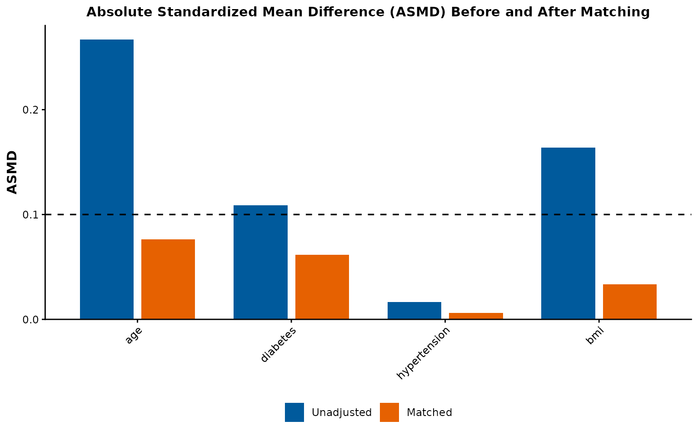
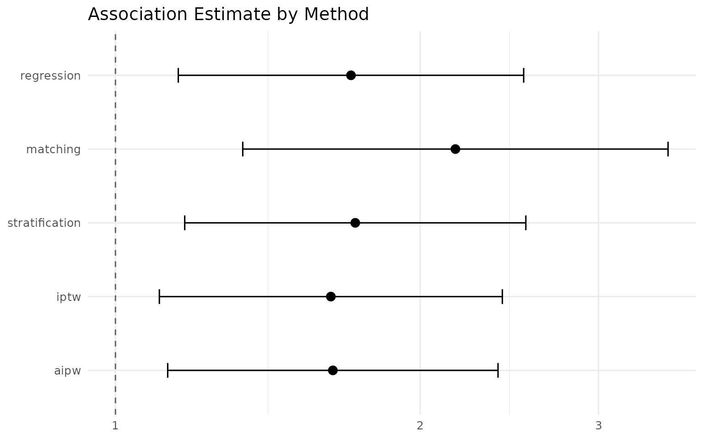

# IndepAssoc: A Quick-Start Guide

## Introduction

`IndepAssoc` generalizes the propensity-score-based analysis pipeline
used in retrospective cohort studies to answer the core scientific
question:

> Is a risk factor or exposure independently associated with an outcome,
> after adjusting for confounders?

Put simply: treated and untreated patients differ in many ways besides
the treatment itself, so a naive comparison of their outcomes can be
misleading. A confounder-adjusted analysis holds those other differences
fixed so that any observed difference in outcome reflects the treatment
— not who happened to receive it.

Matching is used in the context of estimating the effect of a binary
treatment or exposure on an outcome while controlling for measured
pre-treatment variables. The goal of matching is to produce *covariate
balance*, i.e., for the distributions of covariates in the two groups to
be approximately equal, as they would be in a successful randomized
experiment.

A matching analysis with `IndepAssoc` involves four primary steps: 1)
building a propensity score model, 2) matching cohorts, 3) assessing
covariate balance, and 4) estimating the treatment effect using multiple
regression approaches. Here we walk through these steps using a
simulated example dataset.

``` r

library(IndepAssoc)

data(example_cohort)
data <- example_cohort
head(data, 5)
#>   exposure      age diabetes hypertension      bmi outcome_binary
#> 1        1 78.70958        1            0 39.62529              1
#> 2        0 59.35302        0            1 30.62061              1
#> 3        1 68.63128        1            0 32.85367              1
#> 4        1 71.32863        0            1 29.88487              0
#> 5        1 69.04268        0            0 23.02033              1
#>   outcome_continuous
#> 1           95.60768
#> 2           80.28689
#> 3           80.69196
#> 4           79.63079
#> 5           80.06230
```

The dataset contains a binary exposure indicator (`exposure`), baseline
covariates (`age`, `diabetes`, `hypertension`, `bmi`), and two outcomes
(`outcome_binary`, `outcome_continuous`).

## Step 1: Build the Propensity Score Model

The first step is to estimate a propensity score for each unit — the
predicted probability of receiving treatment given the covariates. This
is done via logistic regression.

Think of the propensity score as a single number summarizing how similar
a patient is to the treated group based on their characteristics. Two
patients with the same score are comparable on the measured covariates,
even when their raw characteristics differ — which is what makes the
score useful for matching.

``` r

ps <- build_ps_model(
  data = data,
  exposure = "exposure",
  covariates = c("age", "diabetes", "hypertension", "bmi")
)

summary(ps$model)$coefficients
#>                 Estimate Std. Error    z value    Pr(>|z|)
#> (Intercept)  -2.28986906 0.86724090 -2.6404071 0.008280648
#> age           0.02961410 0.01020326  2.9024155 0.003702971
#> diabetes      0.61916877 0.22644801  2.7342645 0.006251979
#> hypertension  0.12384881 0.19382912  0.6389587 0.522849768
#> bmi           0.03060021 0.02014597  1.5189251 0.128781349
```

The propensity scores are appended to the data as the `.ps` column:

``` r

summary(ps$data$.ps)
#>    Min. 1st Qu.  Median    Mean 3rd Qu.    Max. 
#>  0.3645  0.6084  0.6695  0.6660  0.7283  0.9063
```

## Step 2: Check Initial Imbalance

If the treated and untreated groups differ in their covariates, any
difference in their outcomes could be caused by those covariates rather
than by the treatment. Imbalance is exactly that difference, and
matching works by removing it. Before matching, we can examine the
initial imbalance using
[`cobalt::bal.tab()`](https://ngreifer.github.io/cobalt/reference/bal.tab.html)
via
[`check_balance()`](https://mostafa-abbas.github.io/IndepAssoc/reference/check_balance.md):

``` r

m0 <- match_cohort(ps, caliper = 0.2)
check_balance(m0, threshold = 0.10, plot = FALSE)
#> Covariate balance check
#> =======================
#> Threshold (ASMD): 0.1 
#> Overall balance: FAILED 
#>   4 of 10 covariates below threshold
#>   Largest ASMD: 0.156 (covariate: NA)
#> 
#> Tip: If balance is borderline, consider a tighter caliper
#>    or a larger match ratio in match_cohort().
```

## Step 3: Match Cohorts

We perform 1:1 nearest-neighbor matching on the propensity score without
replacement, with a caliper of 0.2 standard deviations of the logit(PS):

1:1 nearest-neighbor matching pairs each treated patient with the
untreated patient whose propensity score is closest. “Without
replacement” means each patient is used at most once, and the *caliper*
is a tolerance window: a pair is kept only if the two scores are close
enough — here, within 0.2 standard deviations, on the logit scale (a
standard transformation of probabilities). A treated patient with no
untreated counterpart that close is left unmatched.

``` r

matched <- match_cohort(ps, caliper = 0.2)
cat("Unmatched:", nrow(data), "-> Matched:", nrow(matched$data), "observations\n")
#> Unmatched: 500 -> Matched: 324 observations
```

The matched data includes a `match_num` (and `strata`) column
identifying each matched pair.

## Step 4: Assess Covariate Balance

After matching, we assess whether the covariates are balanced between
treatment groups:

``` r

balance <- check_balance(matched, threshold = 0.10)
cat("All balanced:", balance$all_balanced, "\n")
#> All balanced: FALSE
```

`all_balanced` is a strict, all-or-nothing check: it is `TRUE` only if
*every* row in `balance$post` (including the `distance` row — the
propensity score itself) falls under the threshold. Seeing `FALSE` here
is expected and not a sign that matching failed — look at `balance$post`
in the previous section: the actual covariates (`age`, `diabetes`,
`hypertension`, `bmi`) are all comfortably under 0.10, and it is only
the `distance` row, at 0.1565, that pushes the summary flag to `FALSE`.
The propensity score is not itself a clinical covariate you need
balanced — it’s the matching criterion — so a lingering imbalance there
is far less concerning than imbalance on an actual confounder. Treat
`all_balanced` as a quick screening signal that tells you *to go look at
the balance table*, not as a pass/fail verdict on its own.

### Love Plot

[`run_pipeline()`](https://mostafa-abbas.github.io/IndepAssoc/reference/run_pipeline.md)
returns the ASMD chart as part of its result. The `balance_plot` element
visualizes absolute standardized mean differences (ASMD) for each
covariate before and after matching:

ASMD measures how far apart the two groups are on a covariate in
standard-deviation units. Because it is scale-free, covariates measured
on different scales (age in years, BMI, a disease indicator) can be
compared on a single axis.

``` r

result <- run_pipeline(
  data = data,
  exposure = "exposure",
  covariates = c("age", "diabetes", "hypertension", "bmi"),
  outcome = "outcome_binary",
  type = "binary",
  methods = "regression"
)

result$balance_plot
```



Blue bars represent the unmatched cohort and orange bars represent the
matched cohort. All covariates should fall below the dashed line (ASMD
\< 0.10) after matching.

`result$balance_plot` is a standard `ggplot2` object, so it saves like
any other:

``` r

# Save for a manuscript figure
ggsave("balance_plot.png", result$balance_plot, width = 8, height = 5, dpi = 300)
```

## Step 5: Descriptive Tables

### Unmatched Data

For the unmatched data, we use chi-square tests (categorical) and
Wilcoxon rank-sum tests (continuous). The chi-square test compares
proportions between the two groups; the Wilcoxon rank-sum test compares
two continuous distributions without assuming they are normally shaped:

``` r

table_unmatched(data, "exposure", c("age", "diabetes", "hypertension", "bmi"))
```

[TABLE]

### Matched Data

For the matched data, we use paired tests — McNemar (categorical) and
Wilcoxon signed-rank (continuous). Because each pair holds one treated
and one untreated patient, these tests compare outcomes within pairs;
McNemar is the categorical counterpart, and the signed-rank test is the
paired version of the rank-sum test.

[`table_matched()`](https://mostafa-abbas.github.io/IndepAssoc/reference/table_matched.md)
builds one output table per variable type (categorical vs. continuous)
under the hood, so calling it with a mix of both in a single pass
renders as two side-by-side sub-tables that don’t line up cleanly in a
narrow, vignette-width HTML column. Calling it once per type keeps each
table self-contained and readable:

``` r

table_matched(matched, c("diabetes", "hypertension"))
```

[TABLE]

``` r

table_matched(matched, c("age", "bmi"))
```

[TABLE]

## Step 6: Estimate the Treatment Effect

`IndepAssoc` fits three regression models matching common reporting
standards in the cardiac surgery literature (Benedetto et al., 2018):

### Binary Outcome

``` r

models_bin <- fit_all_models(
  ps_model = ps,
  matched_data = matched$data,
  outcome = "outcome_binary",
  type = "binary"
)

models_bin_display <- models_bin$summary_w
models_bin_display$p <- ifelse(models_bin_display$p < 0.001, "<0.001",
                                sprintf("%.3f", models_bin_display$p))
models_bin_display
#>            label                   Model   OR     CI_95     p
#> 1 outcome_binary Fully adjusted logistic 1.71 1.15-2.53 0.008
#> 2 outcome_binary       Conditional logit 2.17 1.34-3.51 0.002
#> 3 outcome_binary   Mixed effect logistic 2.10 1.32-3.36 0.002
```

The three models are:

1.  **Fully adjusted logistic**: GLM on the full unmatched data with all
    covariates
2.  **Conditional logit**: `clogit()` on matched data, stratified by
    pair
3.  **Mixed effect logistic**: `glmer()` on matched data with random
    intercept for pair

### Continuous Outcome

``` r

models_cont <- fit_all_models(
  ps_model = ps,
  matched_data = matched$data,
  outcome = "outcome_continuous",
  type = "continuous"
)

models_cont_display <- models_cont$summary_w
models_cont_display$p <- ifelse(models_cont_display$p < 0.001, "<0.001",
                                 sprintf("%.3f", models_cont_display$p))
models_cont_display
#>                label                            Model     SC         CI_95
#> 1 outcome_continuous Fully adjusted linear regression 0.0334  0.013-0.0538
#> 2 outcome_continuous    Conditional linear regression 0.0466 0.0209-0.0724
#> 3 outcome_continuous   Mixed effect linear regression 0.0466 0.0209-0.0724
#>               SC_CI_95      p
#> 1  0.033(0.013-0.0538)  0.001
#> 2 0.047(0.0209-0.0724) <0.001
#> 3 0.047(0.0209-0.0724) <0.001
```

### Compare All Confounding-Adjustment Methods

Beyond the three regression models above,
[`fit_outcome()`](https://mostafa-abbas.github.io/IndepAssoc/reference/fit_outcome.md)
tests the exposure–outcome association under five confounding-adjustment
methods that share a common tidy result: `regression` (full-sample
adjusted GLM/LM), `matching` (propensity-score matching with
conditional-logit (binary) / within-pair (continuous) estimation),
`stratification` (Mantel–Haenszel quintiles for binary, inverse-variance
pooling for continuous), `iptw` (stabilized inverse-probability weights
with robust `sandwich` (`vcovHC`) standard errors), and `aipw` (Bang &
Robins augmented estimator). `run_pipeline(..., methods = ...)` runs
them all and returns a single comparison table;
[`format_comparison()`](https://mostafa-abbas.github.io/IndepAssoc/reference/format_comparison.md)
renders it as a publication-ready table:

``` r

result <- run_pipeline(
  data = data,
  exposure = "exposure",
  covariates = c("age", "diabetes", "hypertension", "bmi"),
  outcome = "outcome_binary",
  type = "binary",
  methods = c("regression", "matching", "stratification", "iptw", "aipw")
)

format_comparison(result$comparison)
#>           Method   OR    95% CI p-value   n
#> 1     Regression 1.71 1.15–2.53   0.008 500
#> 2       Matching 2.17 1.34–3.51   0.002 324
#> 3 Stratification 1.73 1.17–2.54   0.008 500
#> 4           IPTW 1.63 1.10–2.41   0.014 500
#> 5           AIPW 1.64 1.13–2.39   0.010 500
```

All methods recover a positive association between treatment and the
binary outcome (`estimate` \> 1 on the odds-ratio scale). Agreement
across the five methods — including the matched and weighted estimators
that do not rely on the outcome-regression functional form — is a
reassuring sign that the association is not an artifact of any single
adjustment strategy. Large discrepancies between, say, the regression
and matching estimates often indicate misspecification of the outcome
model or poor overlap, and warrant closer inspection of the
propensity-score distribution.

The comparison table can be visualized directly:

``` r

plot_comparison(result$comparison)
```



## Choosing an adjustment method

The five methods answer the same question — is the exposure
independently associated with the outcome after adjusting for the
measured confounders? — but reach the answer by different routes, and
the right choice depends on the data and the question:

- **Regression** models the outcome directly with all confounders
  included. Efficient and familiar, but the estimate depends on the
  outcome-model functional form, and it extrapolates where propensity
  scores have poor overlap.
- **Matching** discards poorly overlaid units — patients whose
  propensity score has no counterpart in the other group — so inference
  stays close to the data; it answers the treatment-on-the-treated
  question (the effect among the patients who actually received the
  treatment) and is the estimator used in the source cardiac-surgery
  papers. Cost: fewer units and no benefit from observations that do not
  overlap.
- **Stratification** groups patients into propensity-score strata
  (quintiles) and pools within-stratum contrasts. Simple and
  transparent, but residual confounding within strata is a real risk
  when the score’s discriminating power is high.
- **IPTW** reweights the sample to mimic a randomized comparison. It
  uses all units, but very small weights on poorly overlaid patients can
  inflate variance and invite model sensitivity.
- **AIPW** combines an outcome model with a treatment model so the
  estimate stays consistent if only one of the two is correctly
  specified. Doubly robust, and the natural choice when both models are
  plausible.

In practice: run all five through
[`run_pipeline()`](https://mostafa-abbas.github.io/IndepAssoc/reference/run_pipeline.md)
and read the comparison table. Agreement across methods that model the
outcome directly (regression, AIPW) and those that model treatment
assignment (matching, stratification, IPTW) is evidence the association
is not an artifact of any single adjustment strategy. Disagreement flags
misspecification or poor overlap, not a vote — inspect the
propensity-score distribution and the balance tables before trusting any
single estimate.

**A note on pre-specification.** The robustness argument above only
holds if you report all five methods, not just whichever one happens to
give the result you expected. If a single primary method is needed for a
manuscript (reviewers and pre-registered protocols often require one
headline estimate), pick it — typically matching or AIPW, per the
guidance above — *before* looking at the comparison table, and report
the other four as a sensitivity analysis. Choosing the “best-looking”
method after the fact defeats the purpose of running several in the
first place.

## Step 7: Paired Statistical Tests

### McNemar Test (Binary)

``` r

mcnemar_result <- mcnemar_test(matched$data, "outcome_binary", "exposure")
mcnemar_result$p.value <- sprintf("%.3f", mcnemar_result$p.value)
mcnemar_result$statistic <- round(mcnemar_result$statistic, 2)
mcnemar_result$p <- sprintf("%.3f", mcnemar_result$p)
mcnemar_result
#>            label  0(n=162) 1(n=162) statistic p.value     p
#> 1 outcome_binary 74(45.7%) 102(63%)      9.59   0.002 0.002
```

### Paired Wilcoxon Test (Continuous)

``` r

wilcox_result <- paired_wilcoxon_test(matched$data, "outcome_continuous", "exposure")
wilcox_result$p.value <- sprintf("%.3f", wilcox_result$p.value)
wilcox_result
#>                label        0(n=162)        1(n=162) statistic p.value
#> 1 outcome_continuous 84.3(79.2-88.5) 86.1(81.1-90.6)      4734   0.002
```

## Full Pipeline

All steps above can be executed in a single call:

``` r

result <- run_pipeline(
  data = data,
  exposure = "exposure",
  covariates = c("age", "diabetes", "hypertension", "bmi"),
  outcome = "outcome_binary",
  type = "binary"
)

summary(result)
```

## Exporting Results

``` r

export_results(result, output_dir = "output")
```

This writes CSV files for the balance tables, regression summaries, and
statistical tests.

## Reporting Results

To report matching results in a manuscript, include:

1.  The matching specification (method, caliper, ratio)
2.  The distance measure (logistic regression PS)
3.  Covariate balance statistics (ASMD before and after matching, Love
    plot)
4.  Number of matched, unmatched, and discarded units
5.  The method of estimating the treatment effect and standard error
6.  All three regression model results (fully adjusted, conditional,
    mixed effect)

### Example write-up

> We used propensity score matching to estimate the association between
> treatment and outcome while adjusting for age, diabetes, hypertension,
> and BMI. A logistic regression model was used to estimate propensity
> scores, and 1:1 nearest-neighbor matching without replacement was
> performed with a caliper of 0.2 standard deviations of the logit
> propensity score. After matching, all standardized mean differences
> for covariates were below 0.10, indicating adequate balance (Figure
> 1). Three regression models were fitted to the matched cohort: (1) a
> fully adjusted logistic regression on the unmatched data, (2) a
> conditional logistic regression on the matched data stratified by
> pair, and (3) a mixed-effect logistic regression with a random
> intercept for matched pair. All three models showed a statistically
> significant association between treatment and outcome (Table 1).

## References

- Benedetto, U., Head, S.J., Angelini, G.D. and Blackstone, E.H. (2018).
  Statistical primer: propensity score matching and its alternatives.
  *European Journal of Cardio-Thoracic Surgery*, 53(6), pp.1112-1117.

- Ho, D.E., Imai, K., King, G. and Stuart, E.A. (2007). Matching as
  Nonparametric Preprocessing for Reducing Model Dependence in
  Parametric Causal Inference. *Political Analysis*, 15(3), pp.199-236.

- Rosenbaum, P.R. and Rubin, D.B. (1983). The Central Role of the
  Propensity Score in Observational Studies for Causal Effects.
  *Biometrika*, 70(1), pp.41-55.

- Stuart, E.A. (2010). Matching Methods for Causal Inference: A Review
  and a Look Forward. *Statistical Science*, 25(1), pp.1-21.
