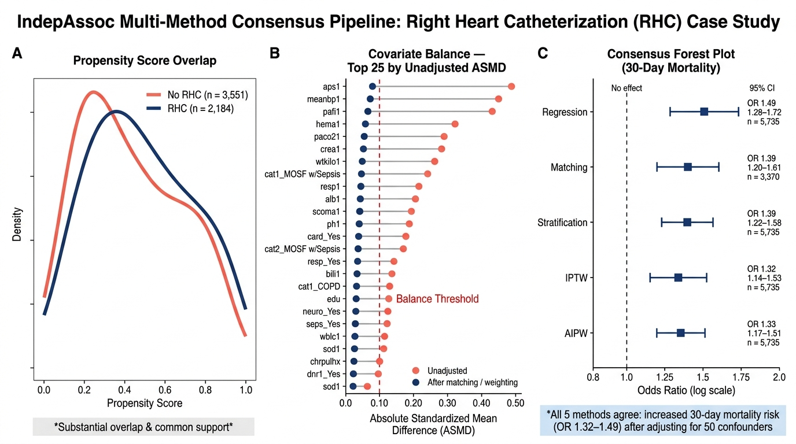

# IndepAssoc

> **One function call. Five independent methods. Publication-ready
> confounder-adjusted associations.**

[](https://github.com/mostafa-abbas/IndepAssoc/actions/workflows/R-CMD-check.yaml)
[](https://opensource.org/licenses/MIT)

**Does an exposure–outcome association survive being tested through five
distinct methods?**

IndepAssoc answers one question: is a risk factor (an exposure)
genuinely associated with an outcome after other relevant factors are
accounted for — or is the apparent link a statistical artifact? Rather
than trusting a single statistical method, the package tests the same
association through five methods that each rely on different modeling
assumptions, and reports whether they agree. When they agree, the
finding is robust; when they do not, the signal warrants a closer look
before it is written up.

## Installation

``` r

# install.packages("remotes")
remotes::install_github("mostafa-abbas/IndepAssoc")
```

Alternatively, install from source with the package checked out locally:

``` r

install.packages("devtools")
devtools::install()
```

`causaldata` and `MatchIt` are additionally needed to build the
vignettes.

## New to these methods?

If you are not a statistician, here is what each method does in one
sentence:

- **Regression** — builds a model of the outcome that includes the
  exposure and the other factors at once, then reports the exposure’s
  association with the outcome after holding the other factors fixed.
- **Matching** — pairs each exposed person with an otherwise similar
  unexposed person and compares outcomes within the pairs.
- **Stratification** — groups people with similar backgrounds, compares
  exposed and unexposed within each group, then pools the comparisons.
- **IPTW (inverse probability of treatment weighting)** — gives each
  person a weight so the exposed and unexposed groups look alike on the
  other factors, then compares the weighted groups.
- **AIPW (augmented IPTW)** — combines the IPTW reweighting with an
  outcome regression; it is doubly robust, so the estimate stays
  reliable if either the propensity model or the outcome model is
  correctly specified, not necessarily both.

## What it is — and what it is not

**What it is:** a pipeline that tests whether an exposure is
independently associated with an outcome — adjusting for confounding
factors via five distinct methods — regression, matching,
stratification, and two propensity-score weighting approaches — and
produces publication-ready tables and effect estimates with minimal
code.

**What it is not:** proof of causation. The package reports
confounder-adjusted associations; it does not establish causal effects.
IPTW and AIPW are causal- inference estimators, but their output
represents a causal effect only if the identifiability assumptions hold:
no unmeasured confounding, positivity (every covariate pattern has a
nonzero chance of both exposure levels), and — for IPTW in particular —
a correctly specified propensity model. An association — however robust
across methods — is not a causal effect, and the package does not claim
otherwise.

**What “all five methods agree” does and does not tell you.**
Cross-method agreement is evidence against *estimator-specific* bias — a
finding that survives five different modeling assumptions is unlikely to
be an artifact of how any one of them was specified. It is not evidence
against *unmeasured confounding*: all five methods adjust for the same
covariate set, so an important confounder left out of that set would
bias all five in the same direction, and agreement across them would
look identical to a genuine effect. Agreement rules out
specification-dependent artifacts; it cannot rule out a shared blind
spot in the confounder list.

## How it works

``` r

library(IndepAssoc)
data(example_cohort)

set.seed(1)
res <- run_pipeline(
  data = example_cohort,
  exposure = "exposure",
  covariates = c("age", "diabetes", "hypertension", "bmi"),
  outcome = "outcome_continuous",
  type = "continuous",
  methods = c("regression", "matching", "stratification", "iptw", "aipw")
)
format_comparison(res$comparison)
```

`example_cohort` is a fully simulated dataset shipped with the package
(see [Datasets](#datasets)) — it carries no patient information of any
kind, and exists purely so the pipeline can be run end-to-end on the
first try.
[`format_comparison()`](https://mostafa-abbas.github.io/IndepAssoc/reference/format_comparison.md)
rounds the raw `$comparison` data frame into the publication-ready table
below. Here `matching` is propensity-score matching with
conditional-logit/paired estimation (conditional logistic regression
stratified by matched pair for binary outcomes, a within-pair
fixed-effects linear model for continuous outcomes).

              Method Mean Diff     95% CI p-value   n
    1     Regression      1.54  0.59–2.48   0.001 500
    2       Matching      2.15  0.95–3.34  <0.001 324
    3 Stratification      1.58  0.45–2.71   0.006 500
    4           IPTW      1.38 -0.05–2.81   0.059 500
    5           AIPW      1.48  0.51–2.46   0.003 500

The five methods do not all target the same estimand, and point
estimates are not expected to be numerically identical even when every
model is correctly specified:

| Method | Estimand | Pooling / SE |
|----|----|----|
| Regression | Conditional (covariate-adjusted) effect | Model-based Wald SE |
| Matching | ATT | Conditional logit (binary) / within-pair fixed-effects OLS (continuous) |
| Stratification | ATE or ATT (5 propensity-score strata by default) | Binary+ATE: Cochran–Mantel–Haenszel; other cases: inverse-variance- or treated-count-weighted pooling across strata |
| IPTW | ATE (stabilized weights) or ATT | Sandwich (HC0) SE on the weighted outcome model |
| AIPW | ATE or ATT | Empirical influence-function variance (doubly robust) |

`matching` targets the ATT by construction; `iptw` and `aipw` default to
the marginal ATE over the full analytic sample; `stratification`’s
pooling rule depends on the outcome type and estimand rather than being
a single fixed formula (see the technical vignette for the exact rule
used in each case); `regression` reports a conditional effect, and for
binary outcomes the odds ratio is non-collapsible, so it is not
numerically equal to a marginal ATE. Agreement across the five is still
meaningful robustness evidence, but they are related quantities, not
five copies of one number.

**A worked example of why this matters:** the IPTW row below is the one
result close to the significance threshold. IPTW weights are not trimmed
by default. Re-running the same call with light trimming of extreme
weights (`fit_outcome(..., method = "iptw", trim = 0.01)`) moves the
estimate from 1.38 (95% CI −0.05 to 2.81, p = 0.059) to 1.58 (95% CI
0.20 to 2.95, p = 0.025) — the same data, the same model, a materially
different conclusion. This is exactly why the diagnostics below exist: a
borderline p-value on a weighted estimator is a prompt to look at the
weight distribution before reporting it, not to report it as-is.

**Data requirements:** all specified covariates must be complete (no
missing values) — the pipeline does not currently perform automatic case
deletion or imputation, and will error on covariate missingness rather
than silently dropping rows. Handle missing data before calling
[`run_pipeline()`](https://mostafa-abbas.github.io/IndepAssoc/reference/run_pipeline.md).

## Diagnostics

Every call to
[`run_pipeline()`](https://mostafa-abbas.github.io/IndepAssoc/reference/run_pipeline.md)
automatically computes propensity-score positivity and covariate balance
— no extra step required. They’re worth checking before trusting any of
the five effect estimates:

``` r

check_positivity(res$ps_model)
check_balance(res$matched)
res$balance_plot   # ggplot Love plot: ASMD before vs. after matching
```

Here’s what that looks like on the quickstart example above —
`summary(res)` reports it plainly:

    Balance check: FAILED

The post-match ASMD on the propensity-score distance itself is 0.157,
above the default 0.1 threshold, even though all four individual
covariates balance well (0.006–0.076). That doesn’t invalidate the other
four methods’ estimates, but it’s a direct, honest signal that this
particular match deserves scrutiny — a tighter caliper or an expanded
propensity model, and the matching-based estimate reported alongside,
not instead of, the other four. This is what the diagnostics are for,
and the package surfaces it without being asked.

## In one picture

Running
[`run_pipeline()`](https://mostafa-abbas.github.io/IndepAssoc/reference/run_pipeline.md)
on the RHC cohort described below (n = 5,735, 50 confounders) — all five
methods agree that RHC is associated with increased 30-day mortality:


Conceptual overview: one association in the data, tested through five
distinct methods (regression, matching, stratification, IPTW, AIPW),
then a check of whether the methods agree



RHC Consensus Plot

## A real-world validation

To confirm the pipeline behaves sensibly outside of simulation, the same
five methods were applied to a long-standing, publicly available
benchmark in the causal-inference literature: the Right Heart
Catheterization (RHC) cohort from the SUPPORT study (Connors et al.,
*JAMA*, 1996), which ships with the package as `rhc_sample` and is also
distributed independently through public data-sharing repositories such
as the `causaldata` R package and the Vanderbilt Department of
Biostatistics. No hospital, health-system, or patient-level data outside
of this public dataset was used at any stage of the package’s
development or testing.

On this cohort (5,735 intensive-care patients, adjusting for 50
confounders), each method independently found that RHC was associated
with increased 30-day mortality, with odds ratios in the 1.3–1.5 range
and confidence intervals excluding no effect:


Forest plot of 30-day mortality odds ratios by method: regression (OR
1.49), matching (OR 1.39), stratification (OR 1.39), IPTW (OR 1.32), and
AIPW (OR 1.33); all confidence intervals exclude 1, so all five methods
agree that right heart catheterization is associated with increased
30-day mortality

That all five methods point the same way on a well-characterized,
public-domain benchmark demonstrates that the pipeline reproduces an
established finding on real clinical data, not only on simulated
cohorts. The full analysis — balance checks, matching diagnostics, and
sensitivity checks — is in the [rhc-validation
vignette](https://mostafa-abbas.github.io/IndepAssoc/articles/rhc-validation.html).

## Package testing & CI

*(Not to be confused with the empirical validation above — this section
describes software correctness, not a clinical finding.)*

The package has 631 passing unit tests and passes `R CMD check` cleanly
(0 errors, 0 notes; one environmental warning — `qpdf` not installed on
the test machine — unrelated to package code). Correctness is checked
against `example_cohort` (simulated, known ground-truth treatment
effect) and `rhc_sample` (the public RHC benchmark described above).

## Background

IndepAssoc is the packaged form of the analysis pipeline used in two
published retrospective cohort studies from the same author group:
*[Female sex is associated with short-term mortality in coronary artery
bypass grafting patients: A propensity-matched
analysis](https://doi.org/10.1016/j.heliyon.2025.e41723)* (Heliyon,
2025) and *[Atrial appendage closure is associated with increased risk
for postoperative atrial
fibrillation](https://doi.org/10.1186/s13019-024-03119-6)* (Journal of
Cardiothoracic Surgery, 2024). Both studies used the same
propensity-score workflow — a logistic propensity-score model, 1:1
nearest-neighbor matching, ASMD balance checks, paired descriptive
tests, and conditional outcome models — which this package generalizes
into a reusable interface with five confounding-adjustment methods. The
source cohorts underlying those two publications are not distributed
with this package; only the simulated and public benchmark datasets
described below are.

## Datasets

Two datasets ship with the package, and both are either fully simulated
or fully public — no proprietary, institutional, or identifiable patient
data is included:

- `example_cohort` — a simulated 500-row cohort with a known treatment
  effect, generated programmatically for quick, reproducible runs of the
  full pipeline.
- `rhc_sample` — a cleaned copy of the public Right Heart
  Catheterization (RHC) cohort from the SUPPORT study (5,735 rows, 50
  confounders), the basis of the `rhc-validation` vignette. This dataset
  is a widely used, openly available benchmark in the causal-inference
  methods literature; it is a confounder-adjusted association benchmark,
  not a proof of causality (see
  [`?rhc_sample`](https://mostafa-abbas.github.io/IndepAssoc/reference/rhc_sample.md)
  for provenance and variable definitions).

Both are lazy-loaded via [`data()`](https://rdrr.io/r/utils/data.html);
the generation and cleaning scripts live in `data-raw/`
(`simulate_example_cohort.R`, `prepare_rhc.R`) and are excluded from the
installed package.

## Reproducibility

Matching-based results draw on the random number generator, so a fixed
seed is required to reproduce them exactly. Set it explicitly —
`run_pipeline(..., seed = N)` or, for direct matching,
`match_cohort(..., seed = N)` — and reuse the same seed value to obtain
identical results.

## Getting Help

- **Bug reports & feature requests:** [Open an
  issue](https://github.com/mostafa-abbas/IndepAssoc/issues)
- **Usage questions:** see the [clinician
  walkthrough](https://mostafa-abbas.github.io/IndepAssoc/articles/clinician-walkthrough.html)
  or [quick-start
  guide](https://mostafa-abbas.github.io/IndepAssoc/articles/indepassoc-quickstart.html)
- **Citing this package:** see `CITATION.cff`, or run
  `citation("IndepAssoc")` in R
